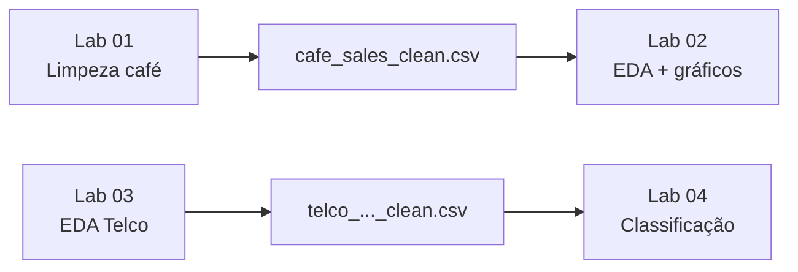

<h1 align="center">MBA Python Data Labs</h1>

<p align="center">
  <strong>Python · Pandas · Matplotlib · Scikit-learn · Google Colab</strong><br />
  <em>Datasets e laboratórios práticos para aulas de análise de dados e primeiros passos em ML.</em>
</p>

<p align="center">
  <a href="https://github.com/sidnei-almeida/mba-python-data-labs"><strong>Ver no GitHub</strong></a>
  &nbsp;·&nbsp;
  <a href="DATASETS.md"><strong>Licenças dos dados</strong></a>
</p>

<p align="center">
  
  
  
  
  
  
  
  
</p>

---

## O que é este repositório

Base centralizada de **CSVs** e **notebooks Jupyter** para laboratórios de Python aplicado a dados. Os alunos abrem o notebook no **Google Colab**, carregam os arquivos via URL do GitHub e seguem o roteiro com exercícios e testes com `assert` — sem upload manual de dados nem instalação local.

O material cobre duas linhas didáticas que se complementam:

| Trilha | Dataset | Labs | Foco |
|--------|---------|------|------|
| **Cafeteria** | Vendas sujas → base limpa | 01 → 02 | Limpeza, EDA e visualização |
| **Telco Churn** | Clientes telecom | 03 → 04 | EDA semi-guiada e classificação com scikit-learn |

> **Público:** iniciantes em Python e Data Science, em turmas MBA ou similares que usam Colab como ambiente principal.

---

## Objetivo

| Meta | Descrição |
|------|-----------|
| **Centralizar dados** | CSVs espelhados do Kaggle (e versões limpas geradas nos labs) |
| **Facilitar o Colab** | Leitura com `pd.read_csv(url)` e `raw.githubusercontent.com` |
| **Progressão clara** | Do CSV sujo ao primeiro modelo de classificação |
| **Reduzir fricção** | Menos setup, mais prática de Pandas, gráficos e ML |

---

## Estrutura do repositório

```text
mba-python-data-labs/
├── data/
│   ├── dirty_cafe_sales.csv              # Kaggle — vendas sujas (cafeteria)
│   ├── cafe_sales_clean.csv              # Derivado — pós Lab 01
│   ├── ml_telco_customer_churn.csv       # Kaggle — churn bruto
│   └── telco_customer_churn_clean.csv    # Derivado — pós Lab 03
├── lab_01_exploracao_limpeza_pandas_colab.ipynb
├── lab_02_analise_visualizacao_pandas_matplotlib.ipynb
├── lab_03_telco_churn_eda_limpeza.ipynb
├── lab_04_telco_churn_classificacao_sklearn_v2.ipynb
├── DATASETS.md                           # Atribuição e licenças dos CSVs
├── LICENSE                               # MIT — notebooks e documentação
└── README.md
```

---

## Trilha recomendada



1. **Lab 01** — explora e limpa `dirty_cafe_sales.csv` (gera `cafe_sales_clean.csv` no notebook; cópia versionada em `data/`).
2. **Lab 02** — analisa e visualiza a base limpa da cafeteria.
3. **Lab 03** — EDA e limpeza semi-guiada do churn (prepara `telco_customer_churn_clean.csv`).
4. **Lab 04** — primeiro modelo com **Decision Tree** e métricas de classificação.

Os Labs 01–02 e 03–04 podem ser ministrados em sequência ou como dois blocos independentes, desde que a base limpa de cada trilha esteja disponível em `data/`.

---

## Datasets disponíveis

| Arquivo | Linhas (aprox.) | Tema | Uso no lab | Status |
|---------|-----------------|------|------------|--------|
| `data/dirty_cafe_sales.csv` | 10 000 | Vendas de cafeteria com ruído (`UNKNOWN`, `ERROR`, NA) | Lab 01 | Disponível |
| `data/cafe_sales_clean.csv` | 7 700 | Vendas tratadas + colunas derivadas | Lab 02 | Disponível |
| `data/ml_telco_customer_churn.csv` | 7 000 | Clientes fictícios de telecom e cancelamento | Lab 03 | Disponível |
| `data/telco_customer_churn_clean.csv` | 7 000 | Versão tratada para modelagem | Lab 04 | Disponível |

**Cafeteria:** ideal para `.replace()`, `.dropna()`, `pd.to_numeric()`, `pd.to_datetime()` e primeiros `.groupby()`.

**Telco:** foco em variável alvo `Churn`, tipos mistos, `TotalCharges` problemático e perguntas de negócio antes do modelo.

Fontes e licenças (Kaggle, CC BY-SA, IBM Sample): **[DATASETS.md](DATASETS.md)**.

---

## Laboratórios

| Lab | Notebook | Dataset principal | O que você pratica |
|-----|----------|-------------------|-------------------|
| **01** — Exploração e limpeza | [`lab_01_exploracao_limpeza_pandas_colab.ipynb`](lab_01_exploracao_limpeza_pandas_colab.ipynb) | `dirty_cafe_sales.csv` | `.head()`, `.info()`, ausentes, limpeza, tipos, `.groupby()`, exportar CSV limpo |
| **02** — EDA e visualização | [`lab_02_analise_visualizacao_pandas_matplotlib.ipynb`](lab_02_analise_visualizacao_pandas_matplotlib.ipynb) | `cafe_sales_clean.csv` | Perguntas de negócio, `.groupby()`, barras, linha, pizza, histograma |
| **03** — EDA e limpeza (semi-guiado) | [`lab_03_telco_churn_eda_limpeza.ipynb`](lab_03_telco_churn_eda_limpeza.ipynb) | `ml_telco_customer_churn.csv` | Balanceamento de `Churn`, missing, numérico vs categórico, gráficos, base limpa |
| **04** — Classificação | [`lab_04_telco_churn_classificacao_sklearn_v2.ipynb`](lab_04_telco_churn_classificacao_sklearn_v2.ipynb) | `telco_customer_churn_clean.csv` | `get_dummies`, train/test, `DecisionTreeClassifier`, acurácia, matriz de confusão, `.joblib` |

Todos os notebooks estão na **raiz** do repositório e foram escritos para rodar no **Colab** de ponta a ponta.

---

## Como usar no Google Colab

### 1. Abrir um notebook

Substitua o nome do arquivo na URL:

```text
https://colab.research.google.com/github/sidnei-almeida/mba-python-data-labs/blob/master/NOME_DO_NOTEBOOK.ipynb
```

| Lab | Link direto (Colab) |
|-----|---------------------|
| 01 | [Abrir Lab 01](https://colab.research.google.com/github/sidnei-almeida/mba-python-data-labs/blob/master/lab_01_exploracao_limpeza_pandas_colab.ipynb) |
| 02 | [Abrir Lab 02](https://colab.research.google.com/github/sidnei-almeida/mba-python-data-labs/blob/master/lab_02_analise_visualizacao_pandas_matplotlib.ipynb) |
| 03 | [Abrir Lab 03](https://colab.research.google.com/github/sidnei-almeida/mba-python-data-labs/blob/master/lab_03_telco_churn_eda_limpeza.ipynb) |
| 04 | [Abrir Lab 04](https://colab.research.google.com/github/sidnei-almeida/mba-python-data-labs/blob/master/lab_04_telco_churn_classificacao_sklearn_v2.ipynb) |

Depois: **Arquivo → Salvar uma cópia no Drive** (cada aluno edita a própria cópia).

### 2. Carregar CSV com Pandas

Padrão usado em todos os labs (branch `master`):

```python
import pandas as pd

# Exemplo — cafeteria (Lab 01)
url = "https://raw.githubusercontent.com/sidnei-almeida/mba-python-data-labs/refs/heads/master/data/dirty_cafe_sales.csv"

df = pd.read_csv(url)
df.head()
```

Outras URLs úteis:

| Arquivo | URL `raw` |
|---------|-----------|
| `cafe_sales_clean.csv` | `.../data/cafe_sales_clean.csv` |
| `ml_telco_customer_churn.csv` | `.../data/ml_telco_customer_churn.csv` |
| `telco_customer_churn_clean.csv` | `.../data/telco_customer_churn_clean.csv` |

Base completa: `https://raw.githubusercontent.com/sidnei-almeida/mba-python-data-labs/refs/heads/master/data/`

### 3. Executar em ordem

Rode as células de cima para baixo. Exercícios com `assert` validam respostas; pular etapas costuma quebrar variáveis usadas mais adiante.

---

## Para quem é este material

- Alunos **iniciantes** em Python (variáveis, listas, funções básicas)
- Quem está aprendendo **Pandas** e **Matplotlib** na prática
- Estudantes de **análise de dados** / MBA que precisam de labs prontos para aula
- Turmas no **Google Colab** sem ambiente local
- Quem quer um **primeiro contato** com scikit-learn (Lab 04), após EDA no Lab 03

Não é necessário instalar Python na máquina para seguir os notebooks, desde que os dados sejam lidos pelas URLs do GitHub.

---

## Boas práticas para os alunos

| Prática | Por quê |
|---------|---------|
| Abrir pelo **link do Colab** | Pandas, Matplotlib e scikit-learn já disponíveis |
| **Salvar cópia no Drive** | Evita alterar o notebook público e perder progresso |
| Executar células **em ordem** | Variáveis e `assert` dependem das etapas anteriores |
| **Ler comentários e markdown** | Explicam decisões de limpeza e de modelagem |
| Tentar exercícios **antes da solução** | Os testes automáticos ajudam a corrigir na hora |
| Nos Labs 03–04, **registrar conclusões** | Partes avaliadas em discussão, não só por `assert` |

---

## Contribuição e evolução

Ao adicionar um dataset ou notebook:

1. Coloque o CSV em `data/` e documente em **[DATASETS.md](DATASETS.md)** (fonte Kaggle, licença, atribuição).
2. Atualize a tabela **Datasets disponíveis** e **Laboratórios** neste README.
3. Use URLs `raw` com o mesmo padrão dos notebooks existentes.

---

## Licença

| Conteúdo | Licença |
|----------|---------|
| Notebooks, README e material didático original | [MIT License](LICENSE) |
| Arquivos em `data/` | Licenças dos autores — ver **[DATASETS.md](DATASETS.md)** |

- **Cafeteria:** `dirty_cafe_sales.csv` e derivado `cafe_sales_clean.csv` — [CC BY-SA 4.0](https://creativecommons.org/licenses/by-sa/4.0/) (Ahmed Mohamed, Kaggle).
- **Telco:** `ml_telco_customer_churn.csv` e derivado — IBM Sample / Kaggle; detalhes e atribuição em [DATASETS.md](DATASETS.md).

---

## Autoria

**Criado por Sidnei Alves de Almeida** — [@sidnei-almeida](https://github.com/sidnei-almeida)

Material desenvolvido para **aulas práticas de Python e análise de dados**: limpeza e exploração com Pandas, visualização com Matplotlib e introdução à classificação com scikit-learn.
